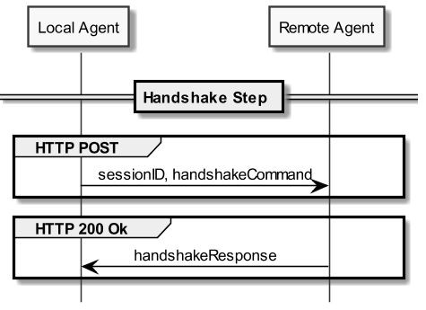
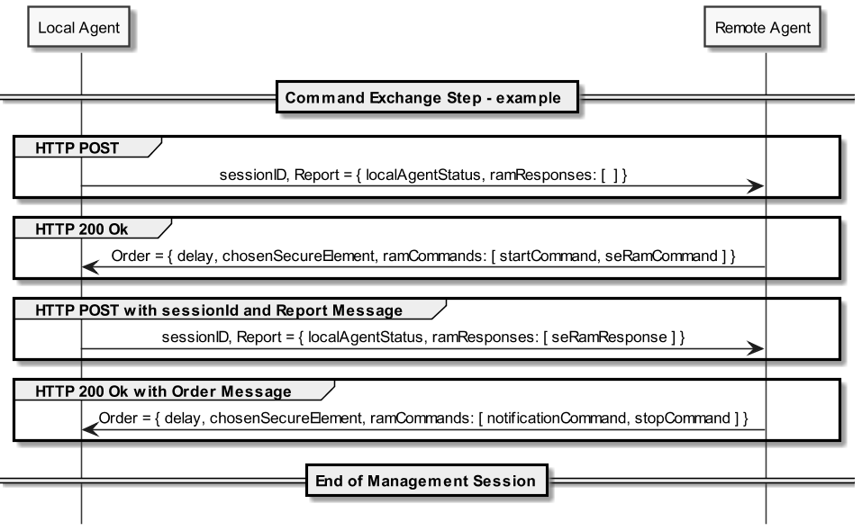
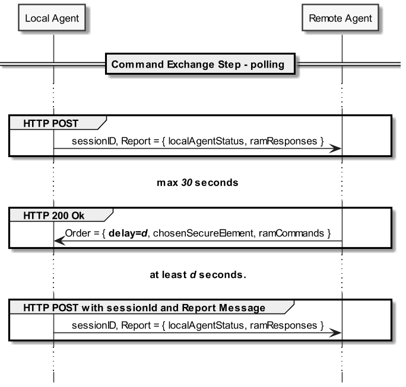

GP SERAM - HTTP REST Binding
============================

This file details the *HTTP REST Binding* which uses HTTPS as [Transport](GPSERAM__Terminology_And_Definitions.md#Transport) protocol layer and JSON as [Data Format](GPSERAM__Terminology_And_Definitions.md#DataFormat) protocol layer.

The [Local Agent](GPSERAM__Terminology_And_Definitions.md#LocalAgent) acts as a HTTP client and the [Remote Agent](GPSERAM__Terminology_And_Definitions.md#RemoteAgent) as a HTTP server. Each GP SERAM [Message](GPSERAM__Terminology_And_Definitions.md#Message) may be transmitted in exactly one HTTP message.

The formal API specification of the *HTTP REST Binding* is provided in [OpenAPI format](/spec/gpseram.yaml). This specification file may be used to generate code skeleton as shown in maven project file (pom.xml).

The *HTTP REST Binding* SHALL comply with:
- [RFC2818 – HTTP Over TLS](https://www.rfc-editor.org/rfc/rfc2818)
- [RFC6265 – HTTP State Management Mechanism](https://www.rfc-editor.org/rfc/rfc6265)
- [RFC7230 – Hypertext Transfer Protocol (HTTP/1.1): Message Syntax and Routing](https://www.rfc-editor.org/rfc/rfc7230)
- [RFC7231 – Hypertext Transfer Protocol (HTTP/1.1): Semantics and Content](https://www.rfc-editor.org/rfc/rfc7231)
- [RFC7232 – Hypertext Transfer Protocol (HTTP/1.1): Conditional Requests](https://www.rfc-editor.org/rfc/rfc7232)
- [RFC7234 – Hypertext Transfer Protocol (HTTP/1.1): Caching](https://www.rfc-editor.org/rfc/rfc7234)

Management Session and HTTP messages
------------------------------------

HTTP messages are attached with a [Managment Session](GPSERAM__Terminology_And_Definitions.md#ManagementSession) based on the [sessionId](GPSERAM__Terminology_And_Definitions.md#sessionId). The [sessionId](GPSERAM__Terminology_And_Definitions.md#sessionId) is explicitly inserted in each HTTP request and implicitly determined for HTTP response based on the client-server paradigm of the HTTP protocol.

Implementors MAY use another HTTP mechanism to reinforce the HTTP session (e.g. HTTP cookies). A [Local Agent](GPSERAM__Terminology_And_Definitions.md#LocalAgent) SHOULD support HTTP cookies as defined in [RFC6265](https://www.rfc-editor.org/rfc/rfc6265).

HTTP REST Endpoints
-------------------

Two endpoints are defined: one to make the [Handshake](GPSERAM__Terminology_And_Definitions.md#Handshake) [Step](GPSERAM__Terminology_And_Definitions.md#Step) and the second to makes the [Command Exchange](GPSERAM__Terminology_And_Definitions.md#CommandExchange) [Step](GPSERAM__Terminology_And_Definitions.md#Step).

| **Endpoint**      | **GP SERAM Step**     | **Description**                                       |
|-------------------|------------------------|-------------------------------------------------------|
| /handshake        | Handshake Step         | Negociate data format and the transport protocol      |
| /remoteManagement | Command Exchange Step  | Method used to respond to a remote management command |

Handshake Step
--------------

The *Handshake Command* [Message](GPSERAM__Terminology_And_Definitions.md#Message) SHALL be mapped to a HTTP POST request and the associated *Handshake Response* [Message](GPSERAM__Terminology_And_Definitions.md#Message) to the associated HTTP Response.

JSON schema for the HTTP request and response during [Handshake](GPSERAM__Terminology_And_Definitions.md#Handshake) [Step](GPSERAM__Terminology_And_Definitions.md#Step) SHALL fullfill the [GP SERAM OpenAPI specification](/spec/gpseram.yaml).

Command Exchange Step
---------------------

The *Order* [Message](GPSERAM__Terminology_And_Definitions.md#Message) SHALL be mapped to an HTTP response  and the associated *Report* [Message](GPSERAM__Terminology_And_Definitions.md#Message) to the next HTTP Request.

The JSON schema for the HTTP request and response during [Command Exchange](GPSERAM__Terminology_And_Definitions.md#CommandExchange) [Step](GPSERAM__Terminology_And_Definitions.md#Step) SHALL fullfill the [GP SERAM OpenAPI specification](/spec/gpseram.yaml).

### HTTP Polling

To allow the [Remote Agent](GPSERAM__Terminology_And_Definitions.md#RemoteAgent) to send *Order* [Messages](GPSERAM__Terminology_And_Definitions.md#Message) to the [Local Agent](GPSERAM__Terminology_And_Definitions.md#LocalAgent), an HTTP polling is used as server-push mechanisms.

During HTTP polling, some void HTTP messages MAY be used. A void HTTP message is any *Order* or *Report* [Message](GPSERAM__Terminology_And_Definitions.md#Message) which doesn’t carry any [Command](GPSERAM__Terminology_And_Definitions.md#Command) or [Response](GPSERAM__Terminology_And_Definitions.md#Response), and which role is to maintain the communication channel between the [Remote Agent](GPSERAM__Terminology_And_Definitions.md#RemoteAgent) and the [Local Agent](GPSERAM__Terminology_And_Definitions.md#LocalAgent). The first HTTP request to the [Remote Agent](GPSERAM__Terminology_And_Definitions.md#RemoteAgent) is always a void HTTP message.

The [Local Agent](GPSERAM__Terminology_And_Definitions.md#LocalAgent) SHALL use HTTP polling whenever awaiting a *Order* [Message](GPSERAM__Terminology_And_Definitions.md#Message). It SHALL NOT use HTTP polling whenever it’s processing the previous *Order* [Message](GPSERAM__Terminology_And_Definitions.md#Message) unless it doesn’t require any [Response](GPSERAM__Terminology_And_Definitions.md#Response).

The [Remote Agent](GPSERAM__Terminology_And_Definitions.md#RemoteAgent) may fine-tune the HTTP polling by controlling the delay between an HTTP response and the next HTTP request. If the [Remote Agent](GPSERAM__Terminology_And_Definitions.md#RemoteAgent) doesn’t specify any delay, the [Local Agent](GPSERAM__Terminology_And_Definitions.md#LocalAgent) SHALL make a pause of 1 second before sending the next HTTP request. The [Remote Agent](GPSERAM__Terminology_And_Definitions.md#RemoteAgent) MAY used a value of 0 to deactivate the delay.

As describes in [RFC6202](https://www.rfc-editor.org/rfc/rfc6202.html), the [Remote Agent](GPSERAM__Terminology_And_Definitions.md#RemoteAgent) MAY use HTTP long polling mechanism and wait a certain period of time before sending the void HTTP response.
[Remote Agent](GPSERAM__Terminology_And_Definitions.md#RemoteAgent) SHOULD NOT use period of time beyond 30 seconds and [Local Agent](GPSERAM__Terminology_And_Definitions.md#LocalAgent) SHOULD at least support latency of 30 seconds between HTTP request and HTTP response.

Transmission Errors
-------------------

The [Local Agent](GPSERAM__Terminology_And_Definitions.md#LocalAgent) and the [Remote Agent](GPSERAM__Terminology_And_Definitions.md#RemoteAgent) relies on HTTP protocol to their exchanges. Most of the transmission errors will be transparently resumed by the TCP (Transmission Control Protocol) end-to-end stack.

Nevertheless, some errors are unrecoverable at TCP level. This section lists the rules a [Local Agent](GPSERAM__Terminology_And_Definitions.md#LocalAgent) and [Remote Agent](GPSERAM__Terminology_And_Definitions.md#RemoteAgent) shall follow to enforce the [Message](GPSERAM__Terminology_And_Definitions.md#Message) delivery or error detection.

Errors may result in a failure on each level of the exchanges:

-   the [Local Agent](GPSERAM__Terminology_And_Definitions.md#LocalAgent)

-   the [Remote Agent](GPSERAM__Terminology_And_Definitions.md#RemoteAgent)

-   the [Device](GPSERAM__Terminology_And_Definitions.md#Device)

-   the [Management Platform](GPSERAM__Terminology_And_Definitions.md#ManagementPlatform)

-   the network

If the HTTPS connection is prematurely closed, the [Local Agent](GPSERAM__Terminology_And_Definitions.md#LocalAgent) SHOULD immediately try to re-establish the HTTPS connection with the [Remote Agent](GPSERAM__Terminology_And_Definitions.md#RemoteAgent).

If the [Local Agent](GPSERAM__Terminology_And_Definitions.md#LocalAgent) could not establish an HTTPS connection or send an HTTP request to the [Remote Agent](GPSERAM__Terminology_And_Definitions.md#RemoteAgent), it SHOULD retry during 5 minutes at the most.

If the [Local Agent](GPSERAM__Terminology_And_Definitions.md#LocalAgent) doesn’t receive an HTTP response within a 40 seconds delay from the [Remote Agent](GPSERAM__Terminology_And_Definitions.md#RemoteAgent), it SHOULD close the current HTTPS connection and try to re-establish a new one.

If a [Remote Agent](GPSERAM__Terminology_And_Definitions.md#RemoteAgent) could not send an HTTP response to a [Local Agent](GPSERAM__Terminology_And_Definitions.md#LocalAgent) within a 30 seconds delay, it SHALL close the current HTTPS connection and SHOULD await the [Local Agent](GPSERAM__Terminology_And_Definitions.md#LocalAgent) reconnection.

A [Remote Agent](GPSERAM__Terminology_And_Definitions.md#RemoteAgent) SHOULD consider having lost a [Local Agent](GPSERAM__Terminology_And_Definitions.md#LocalAgent) after a 5-minute delay.

