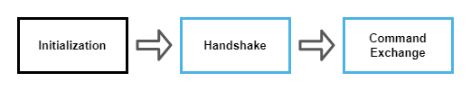

GP SERAM - Protocol Overview
============================

This specification defines a protocol that allows a [Device Application](GPSERAM__Terminology_And_Definitions.md#DeviceApplication) to request the management of a [Secure Element](GPSERAM__Terminology_And_Definitions.md#SecureElement) by a [Management Platform](GPSERAM__Terminology_And_Definitions.md#ManagementPlatform).

The following figure presents the global architecture of GP SERAM and its environment. All words in blue are defined in this specification.

In this architecture, a [Remote Agent](GPSERAM__Terminology_And_Definitions.md#RemoteAgent) and a [Local Agent](GPSERAM__Terminology_And_Definitions.md#LocalAgent) manage this protocol to allow the [Management Platform](GPSERAM__Terminology_And_Definitions.md#ManagementPlatform) to interact with a [Device Application](GPSERAM__Terminology_And_Definitions.md#DeviceApplication) and the [Secure Element](GPSERAM__Terminology_And_Definitions.md#SecureElement).

While [Management Platform](GPSERAM__Terminology_And_Definitions.md#ManagementPlatform), [Device](GPSERAM__Terminology_And_Definitions.md#Device) and [Secure Element](GPSERAM__Terminology_And_Definitions.md#SecureElement) are physical entities, the [Device Application](GPSERAM__Terminology_And_Definitions.md#DeviceApplication) and [Core Management Platform](GPSERAM__Terminology_And_Definitions.md#CoreManagementPlatform) are logical components, and the [Remote Agent](GPSERAM__Terminology_And_Definitions.md#RemoteAgent) and the [Local Agent](GPSERAM__Terminology_And_Definitions.md#LocalAgent) in this specification are to be considered as functions. These functions might be implemented as standalone applications or as libraries integrated inside larger business applications. In the GP SERAM context, the terms [Remote Agent](GPSERAM__Terminology_And_Definitions.md#RemoteAgent) and [Local Agent](GPSERAM__Terminology_And_Definitions.md#LocalAgent) may be used interchangeably with *Remote Agent function* and *Local Agent function*.

Note that if the [Device](GPSERAM__Terminology_And_Definitions.md#Device) embeds a [Trusted Execution Environment](GPSERAM__Terminology_And_Definitions.md#TrustedExecutionEnvironment), the [Local Agent](GPSERAM__Terminology_And_Definitions.md#LocalAgent) may be implemented in this [Trusted Execution Environment](GPSERAM__Terminology_And_Definitions.md#TrustedExecutionEnvironment).  Otherwise, the [Local Agent](GPSERAM__Terminology_And_Definitions.md#LocalAgent) is implemented in the [Rich Execution Environment](GPSERAM__Terminology_And_Definitions.md#RichExecutionEnvironment) of the [Device](GPSERAM__Terminology_And_Definitions.md#Device). In these two cases, the [Local Agent](GPSERAM__Terminology_And_Definitions.md#LocalAgent) will have to use an API providing access to the [Secure Element](GPSERAM__Terminology_And_Definitions.md#SecureElement) and allowing it to forward commands to an application in this [Secure Element](GPSERAM__Terminology_And_Definitions.md#SecureElement). This API is called an [SE Access API](GPSERAM__Terminology_And_Definitions.md#SEAccessAPI) in this specification. The [SE Access API](GPSERAM__Terminology_And_Definitions.md#SEAccessAPI) can be the [SIMalliance GlobalPlatform Open Mobile API](https://globalplatform.org/specs-library/open-mobile-api-specification-v3-3/) when the [Local Agent](GPSERAM__Terminology_And_Definitions.md#LocalAgent) is implemented in the [Rich Execution Environment](GPSERAM__Terminology_And_Definitions.md#RichExecutionEnvironment) (REE), and the [GlobalPlatform TEE Secure Element API](https://globalplatform.org/specs-library/tee-secure-element-api/) when the [Local Agent](GPSERAM__Terminology_And_Definitions.md#LocalAgent) is implemented in the [Trusted Execution Environment](GPSERAM__Terminology_And_Definitions.md#TrustedExecutionEnvironment) (TEE).

More precisely, an [SE Access API](GPSERAM__Terminology_And_Definitions.md#SEAccessAPI) usually provides mechanisms for a device application to open a connection with the [Secure Element](GPSERAM__Terminology_And_Definitions.md#SecureElement) and then to open a logical channel with a card application in order to send *APDUs* to this application.

Protocol design
---------------

### Protocol Layers

GP SERAM is a message-oriented protocol which used the following protocol stack:

[Messages](GPSERAM__Terminology_And_Definitions.md#Message) are the data exchanged between the [Remote Agent](GPSERAM__Terminology_And_Definitions.md#RemoteAgent) and the [Local Agent](GPSERAM__Terminology_And_Definitions.md#LocalAgent). The definition, the meaning and sequency of [Messages](GPSERAM__Terminology_And_Definitions.md#Message) are states below in the [Messages section](#messages).

How [Messages](GPSERAM__Terminology_And_Definitions.md#Message) are carried on the network relies on the [Protocol Binding](GPSERAM__Terminology_And_Definitions.md#ProtocolBinding) used by the [Remote Agent](GPSERAM__Terminology_And_Definitions.md#RemoteAgent) and the [Local Agent](GPSERAM__Terminology_And_Definitions.md#LocalAgent). A [Protocol Binding](GPSERAM__Terminology_And_Definitions.md#ProtocolBinding) defines the rules to map [Messages](GPSERAM__Terminology_And_Definitions.md#Message) on the [Data Format](GPSERAM__Terminology_And_Definitions.md#DataFormat) layer and the [Transport](GPSERAM__Terminology_And_Definitions.md#Transport) layer.

This version of the specification defines the following [Data Format](GPSERAM__Terminology_And_Definitions.md#DataFormat) and [Transport](GPSERAM__Terminology_And_Definitions.md#Transport) protocol layers:

-   **HTTPS** as [Transport](GPSERAM__Terminology_And_Definitions.md#Transport)

-   **JSON** as [Data Format](GPSERAM__Terminology_And_Definitions.md#DataFormat)

Others protocol layer elements may be defined in the future.

This version of the specification defined the following [Protocol Binding](GPSERAM__Terminology_And_Definitions.md#ProtocolBinding):

-   **HTTP REST**, which uses HTTPS as [Transport](GPSERAM__Terminology_And_Definitions.md#Transport) protocol and JSON as [Data Format](GPSERAM__Terminology_And_Definitions.md#DataFormat).

Others [Protocol Binding](GPSERAM__Terminology_And_Definitions.md#ProtocolBinding) may be defined in the future.

### Management Session

A [Device Application](GPSERAM__Terminology_And_Definitions.md#DeviceApplication) and a [Management Platform](GPSERAM__Terminology_And_Definitions.md#ManagementPlatform) relies on a session identifier, named [sessionId](GPSERAM__Terminology_And_Definitions.md#sessionId). The [sessionId](GPSERAM__Terminology_And_Definitions.md#sessionId) is shared and used for all communications between the [Remote Agent](GPSERAM__Terminology_And_Definitions.md#RemoteAgent) and the [Remote Agent](GPSERAM__Terminology_And_Definitions.md#RemoteAgent).

The session during which is performed some management tasks that are associated with one sessionId is called the [Management Session](GPSERAM__Terminology_And_Definitions.md#ManagementSession).

In term of GP SERAM protocol, the [Management Session](GPSERAM__Terminology_And_Definitions.md#ManagementSession) is started by the triggering of the [Local Agent](GPSERAM__Terminology_And_Definitions.md#LocalAgent) by the [Device Application](GPSERAM__Terminology_And_Definitions.md#DeviceApplication) and is then controlled until its end by the [Remote Agent](GPSERAM__Terminology_And_Definitions.md#RemoteAgent).

### Protocol Steps

As shown by the next figure, this protocol has three steps. First the [Local Agent](GPSERAM__Terminology_And_Definitions.md#LocalAgent) is triggered by the [Device Application](GPSERAM__Terminology_And_Definitions.md#DeviceApplication) with the [sessionId](GPSERAM__Terminology_And_Definitions.md#sessionId) and the [RA Endpoint](GPSERAM__Terminology_And_Definitions.md#RAEndpoint). It then negotiates the [Data Format](GPSERAM__Terminology_And_Definitions.md#DataFormat) and [Transport](GPSERAM__Terminology_And_Definitions.md#Transport) protocol to use with the [Remote Agent](GPSERAM__Terminology_And_Definitions.md#RemoteAgent). Finally, the [Remote Agent](GPSERAM__Terminology_And_Definitions.md#RemoteAgent) make the task required for the [Management Session](GPSERAM__Terminology_And_Definitions.md#ManagementSession).

Most of the [Initialization](GPSERAM__Terminology_And_Definitions.md#Initialization) [Step](GPSERAM__Terminology_And_Definitions.md#Step) is out of the scope of this document.

During the [Handshake](GPSERAM__Terminology_And_Definitions.md#Handshake) [Step](GPSERAM__Terminology_And_Definitions.md#Step), the [Local Agent](GPSERAM__Terminology_And_Definitions.md#LocalAgent) performs a protocol negotiation with the [Remote Agent](GPSERAM__Terminology_And_Definitions.md#RemoteAgent), by sending its capabilities, the session identifier, and a list of manageable [Secure Element](GPSERAM__Terminology_And_Definitions.md#SecureElement). A [Protocol Binding](GPSERAM__Terminology_And_Definitions.md#ProtocolBinding) to be used for the next step is then selected.

Next, the [Management Platform](GPSERAM__Terminology_And_Definitions.md#ManagementPlatform) starts a [Command Exchange](GPSERAM__Terminology_And_Definitions.md#CommandExchange) [Step](GPSERAM__Terminology_And_Definitions.md#Step) by sending a *Start* [Command](GPSERAM__Terminology_And_Definitions.md#Command). During the [Command Exchange](GPSERAM__Terminology_And_Definitions.md#CommandExchange), the [Management Platform](GPSERAM__Terminology_And_Definitions.md#ManagementPlatform) may send *APDUs* to the [Secure Element](GPSERAM__Terminology_And_Definitions.md#SecureElement), or send notifications to the [Device Application](GPSERAM__Terminology_And_Definitions.md#DeviceApplication). The end of the [Management Session](GPSERAM__Terminology_And_Definitions.md#ManagementSession) is announced by a *Stop* [Command](GPSERAM__Terminology_And_Definitions.md#Command) form the [Management Platform](GPSERAM__Terminology_And_Definitions.md#ManagementPlatform).

Protocol Steps details
----------------------

### Initialization Step

During this phase, a session identifier, named [sessionId](GPSERAM__Terminology_And_Definitions.md#sessionId), SHALL be generated and shared between the [Device Application](GPSERAM__Terminology_And_Definitions.md#DeviceApplication) and the [Management Platform](GPSERAM__Terminology_And_Definitions.md#ManagementPlatform). How, when, and by whom this [sessionId](GPSERAM__Terminology_And_Definitions.md#sessionId) is generated is out of the scope of this specification and it just needs to be understandable by the [Management Platform](GPSERAM__Terminology_And_Definitions.md#ManagementPlatform).

The [sessionId](GPSERAM__Terminology_And_Definitions.md#sessionId) SHALL be a unique identifier for the [Device Application](GPSERAM__Terminology_And_Definitions.md#DeviceApplication) and the [Management Platform](GPSERAM__Terminology_And_Definitions.md#ManagementPlatform). How this uniqueness is handled is out of the scope of this specification.

Moreover, the [RA Endpoint](GPSERAM__Terminology_And_Definitions.md#RAEndpoint) to communicate with the [Remote Agent](GPSERAM__Terminology_And_Definitions.md#RemoteAgent) MUST also be shared between entities. How this [RA Endpoint](GPSERAM__Terminology_And_Definitions.md#RAEndpoint) is defined and shared is out of the scope of this specification.

The GP SERAM [Management Session](GPSERAM__Terminology_And_Definitions.md#ManagementSession) starts after the [Local Agent](GPSERAM__Terminology_And_Definitions.md#LocalAgent) is triggered with the [sessionId](GPSERAM__Terminology_And_Definitions.md#sessionId) and the [RA Endpoint](GPSERAM__Terminology_And_Definitions.md#RAEndpoint) of the [Remote Agent](GPSERAM__Terminology_And_Definitions.md#RemoteAgent). Then, the [Local Agent](GPSERAM__Terminology_And_Definitions.md#LocalAgent) starts with the [Handshake](GPSERAM__Terminology_And_Definitions.md#Handshake) [Step](GPSERAM__Terminology_And_Definitions.md#Step).

### Handshake Step

As soon as it was triggered, the [Local Agent](GPSERAM__Terminology_And_Definitions.md#LocalAgent) shall start the [Handshake](GPSERAM__Terminology_And_Definitions.md#Handshake) [Step](GPSERAM__Terminology_And_Definitions.md#Step).

Handshaking allows a [Local Agent](GPSERAM__Terminology_And_Definitions.md#LocalAgent) and [Remote Agent](GPSERAM__Terminology_And_Definitions.md#RemoteAgent) to negotiate the [Data Format](GPSERAM__Terminology_And_Definitions.md#DataFormat) and the [Transport](GPSERAM__Terminology_And_Definitions.md#Transport) protocol used to perform the remote management.

This method shall be used by the [Local Agent](GPSERAM__Terminology_And_Definitions.md#LocalAgent) to tell which [Data Format](GPSERAM__Terminology_And_Definitions.md#DataFormat) and which [Transport](GPSERAM__Terminology_And_Definitions.md#Transport) protocols it supports. In response, the [Remote Agent](GPSERAM__Terminology_And_Definitions.md#RemoteAgent) shall tell which ones it selects.

The attributes which are negotiated are:

-   The secure elements: the [Local Agent](GPSERAM__Terminology_And_Definitions.md#LocalAgent) provides a list of [Secure Element](GPSERAM__Terminology_And_Definitions.md#SecureElement) which may be targeted by the [Remote Agent](GPSERAM__Terminology_And_Definitions.md#RemoteAgent)

-   The [Data Format](GPSERAM__Terminology_And_Definitions.md#DataFormat) (e.g. JSON)

-   The [Transport](GPSERAM__Terminology_And_Definitions.md#Transport) protocols (e.g. HTTPS)

-   The version of the protocol

To allow the [Remote Agent](GPSERAM__Terminology_And_Definitions.md#RemoteAgent) to track the [Command Exchange](GPSERAM__Terminology_And_Definitions.md#CommandExchange) the [Local Agent](GPSERAM__Terminology_And_Definitions.md#LocalAgent) provides a [sessionId](GPSERAM__Terminology_And_Definitions.md#sessionId) that shall be reused in all subsequent exchanges as defined by the selected [Protocol Binding](GPSERAM__Terminology_And_Definitions.md#ProtocolBinding).

The [Handshake](GPSERAM__Terminology_And_Definitions.md#Handshake) [Step](GPSERAM__Terminology_And_Definitions.md#Step) shall be performed using the *HTTP REST* [Protocol Binding](GPSERAM__Terminology_And_Definitions.md#ProtocolBinding).

### Command Exchange Step

During the [Command Exchange](GPSERAM__Terminology_And_Definitions.md#CommandExchange) [Step](GPSERAM__Terminology_And_Definitions.md#Step), the [Remote Agent](GPSERAM__Terminology_And_Definitions.md#RemoteAgent) performs a series of actions by sending [Commands](GPSERAM__Terminology_And_Definitions.md#Command) to the [Local Agent](GPSERAM__Terminology_And_Definitions.md#LocalAgent). The [Local Agent](GPSERAM__Terminology_And_Definitions.md#LocalAgent) processed each [Command](GPSERAM__Terminology_And_Definitions.md#Command) and if required send a [Response](GPSERAM__Terminology_And_Definitions.md#Response) to the [Remote Agent](GPSERAM__Terminology_And_Definitions.md#RemoteAgent).

[Commands](GPSERAM__Terminology_And_Definitions.md#Command) and [Responses](GPSERAM__Terminology_And_Definitions.md#Response) are exchanged using, respectively, *Order* [Messages](GPSERAM__Terminology_And_Definitions.md#Message) and *Report* [Messages](GPSERAM__Terminology_And_Definitions.md#Message). An  *Order* [Message](GPSERAM__Terminology_And_Definitions.md#Message) sent by the [Remote Agent](GPSERAM__Terminology_And_Definitions.md#RemoteAgent) may carry one or more [Command](GPSERAM__Terminology_And_Definitions.md#Command). Similary, a *Report* [Message](GPSERAM__Terminology_And_Definitions.md#Message) from the [Local Agent](GPSERAM__Terminology_And_Definitions.md#LocalAgent) may carry one or more [Response](GPSERAM__Terminology_And_Definitions.md#Response). [Messages](GPSERAM__Terminology_And_Definitions.md#Message) which are exchanges during the [Command Exchange](GPSERAM__Terminology_And_Definitions.md#CommandExchange) [Step](GPSERAM__Terminology_And_Definitions.md#Step) shall use the [Protocol Binding](GPSERAM__Terminology_And_Definitions.md#ProtocolBinding) which has been selected during the [Handshake](GPSERAM__Terminology_And_Definitions.md#Handshake) [Step](GPSERAM__Terminology_And_Definitions.md#Step).

As shown by the diagram, the first and last [Command](GPSERAM__Terminology_And_Definitions.md#Command) of the [Command Exchange](GPSERAM__Terminology_And_Definitions.md#CommandExchange) [Step](GPSERAM__Terminology_And_Definitions.md#Step) is respectively the *Start* [Command](GPSERAM__Terminology_And_Definitions.md#Command) and *Stop* [Command](GPSERAM__Terminology_And_Definitions.md#Command). Other *RAM* [Commands](GPSERAM__Terminology_And_Definitions.md#Command) are used to send *APDUs* to the [Secure Element](GPSERAM__Terminology_And_Definitions.md#SecureElement), or *Notifications* to the [Device Application](GPSERAM__Terminology_And_Definitions.md#DeviceApplication). Only the *Start* and *Stop* [Commands](GPSERAM__Terminology_And_Definitions.md#Command) are mandatory.

Protocol overview diagram
-------------------------

The following sequence diagram resumes the main exchanges during a [Management Session](GPSERAM__Terminology_And_Definitions.md#ManagementSession). In the diagram the exchanges during the [Command Exchange](GPSERAM__Terminology_And_Definitions.md#CommandExchange) [Step](GPSERAM__Terminology_And_Definitions.md#Step) are illustrated with the two types of *RAM* [Command](GPSERAM__Terminology_And_Definitions.md#Command) that can be sent by a [Remote Agent](GPSERAM__Terminology_And_Definitions.md#RemoteAgent) after the *Start* [Command](GPSERAM__Terminology_And_Definitions.md#Command) and until the *Stop* [Command](GPSERAM__Terminology_And_Definitions.md#Command).

Messages
========

The following type of [Messages](GPSERAM__Terminology_And_Definitions.md#Message) may be exchanged between [Local Agent](GPSERAM__Terminology_And_Definitions.md#LocalAgent) and [Remote Agent](GPSERAM__Terminology_And_Definitions.md#RemoteAgent):

| Protocol Step    | Messages               | From         | To           |
|------------------|------------------------|--------------|--------------|
| Handshake        | **Handshake Command**  | Local Agent  | Remote Agent |
| Handshake        | **Handshake Response** | Remote Agent | Local Agent  |
| Command Exchange | **Order**              | Remote Agent | Local Agent  |
| Command Exchange | **Report**             | Local Agent  | Remote Agent |

Local Agent Behaviour
=====================

As soon as triggered, the Local Agent starts the Handshake Step by sending a *Handshake Command* [Message](GPSERAM__Terminology_And_Definitions.md#Message) to the [Remote Agent](GPSERAM__Terminology_And_Definitions.md#RemoteAgent) with the a list of manageable [Secure Element](GPSERAM__Terminology_And_Definitions.md#SecureElement).

On reception of the *Handshake Response* [Message](GPSERAM__Terminology_And_Definitions.md#Message) from the [Remote Agent](GPSERAM__Terminology_And_Definitions.md#RemoteAgent), the [Local Agent](GPSERAM__Terminology_And_Definitions.md#LocalAgent) goes to the next [Command Exchange](GPSERAM__Terminology_And_Definitions.md#CommandExchange) [Step](GPSERAM__Terminology_And_Definitions.md#Step) using the selected [Protocol Binding](GPSERAM__Terminology_And_Definitions.md#ProtocolBinding). During this [Step](GPSERAM__Terminology_And_Definitions.md#Step), the [Local Agent](GPSERAM__Terminology_And_Definitions.md#LocalAgent) proceeds the [Command](GPSERAM__Terminology_And_Definitions.md#Command) from *Order* [Messages](GPSERAM__Terminology_And_Definitions.md#Message) one-by-one and, if required, it appends the associated [Response](GPSERAM__Terminology_And_Definitions.md#Response) into *Report* [Messages](GPSERAM__Terminology_And_Definitions.md#Message). As the first [Command](GPSERAM__Terminology_And_Definitions.md#Command) shall be a *Start* and the last one a *Stop*, the internal state machine of the [Local Agent](GPSERAM__Terminology_And_Definitions.md#LocalAgent) is detailed in the next figure:

On *Notification* [Command](GPSERAM__Terminology_And_Definitions.md#Command) the [Local Agent](GPSERAM__Terminology_And_Definitions.md#LocalAgent) shall sent a notification to the [Device Application](GPSERAM__Terminology_And_Definitions.md#DeviceApplication). How the [Device](GPSERAM__Terminology_And_Definitions.md#Device) notify the [Device Application](GPSERAM__Terminology_And_Definitions.md#DeviceApplication) and its reliability is implementation dependent. *Notification* [Command](GPSERAM__Terminology_And_Definitions.md#Command) do not require [Response](GPSERAM__Terminology_And_Definitions.md#Response), nor a state change.

On *SE RAM* [Command](GPSERAM__Terminology_And_Definitions.md#Command) the [Local Agent](GPSERAM__Terminology_And_Definitions.md#LocalAgent) shall send each *C-APDU* to the selected [Secure Element](GPSERAM__Terminology_And_Definitions.md#SecureElement) according with the [SE Access API](GPSERAM__Terminology_And_Definitions.md#SEAccessAPI) and add the *R-APDU* to the *SE RAM* [Response](GPSERAM__Terminology_And_Definitions.md#Response). If the *C-APDU* is a *SELECT Command* as defined by [GP Card Specification](https://globalplatform.org/specs-library/card-specification-v2-3-1/), the [SE Access API](GPSERAM__Terminology_And_Definitions.md#SEAccessAPI), may required the [Local Agent](GPSERAM__Terminology_And_Definitions.md#LocalAgent) to use a dedicated function to open a *logicial channel* with the [Secure Element](GPSERAM__Terminology_And_Definitions.md#SecureElement). This *logicial channel* shall be used for the subsequent *C-APDU* and closed if another *SELECT Command* is received or at the end of the *Management Session*. On any error to transmit the *C-APDU*, the [Local Agent](GPSERAM__Terminology_And_Definitions.md#LocalAgent) shall discard all the remaining *C-APDU* and shall not include any *R-APDU* in the response for the faulty transmission. The [Local Agent](GPSERAM__Terminology_And_Definitions.md#LocalAgent) do not need to parse and handle *R-APDU*. Any warning or error *R-ADPDU* (i.e. those with a 69xx or 68xx status word) are valid *R-APDU* that shall be added to the *SE RAM* [Response](GPSERAM__Terminology_And_Definitions.md#Response).

